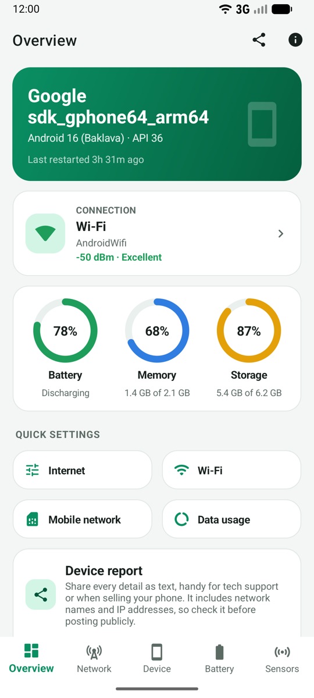
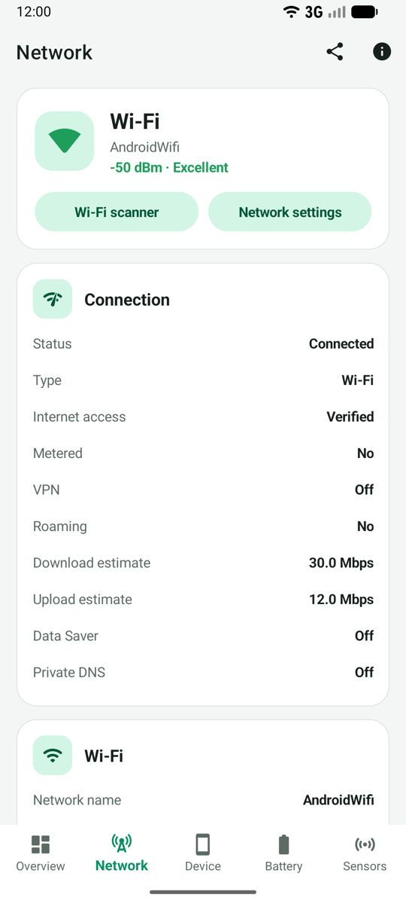
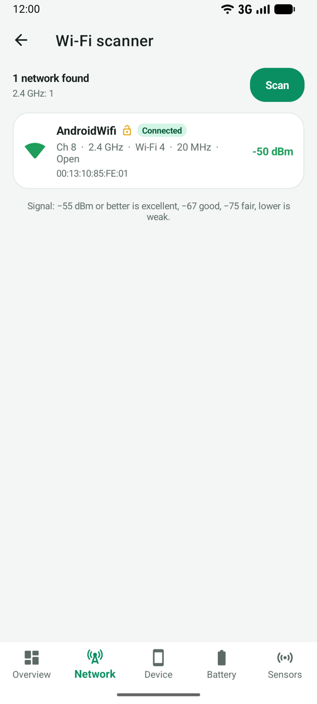
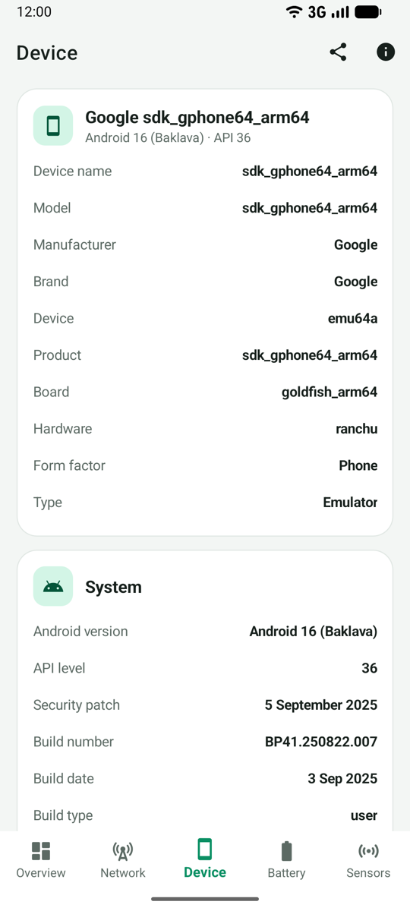
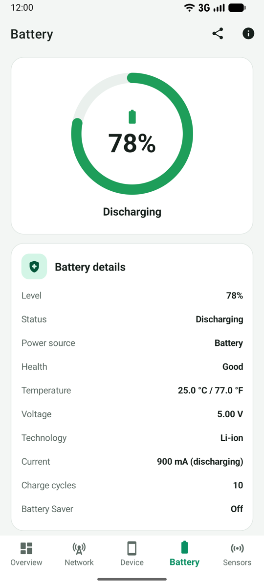
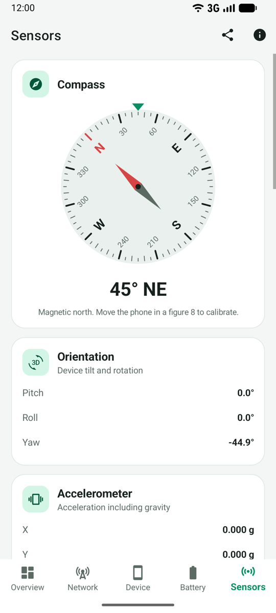
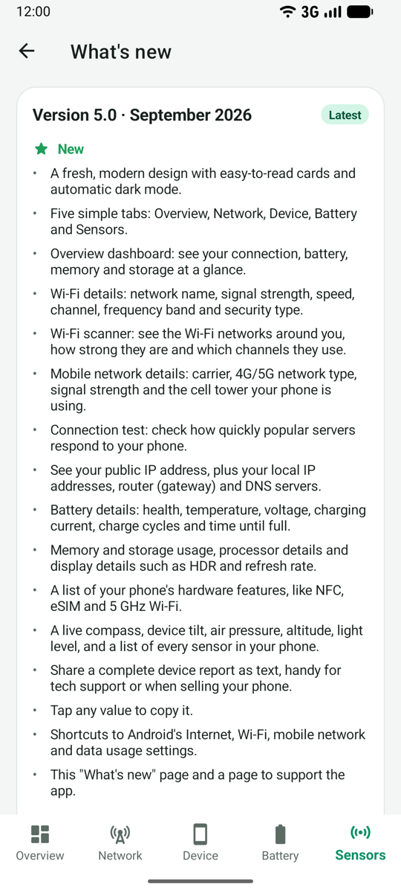
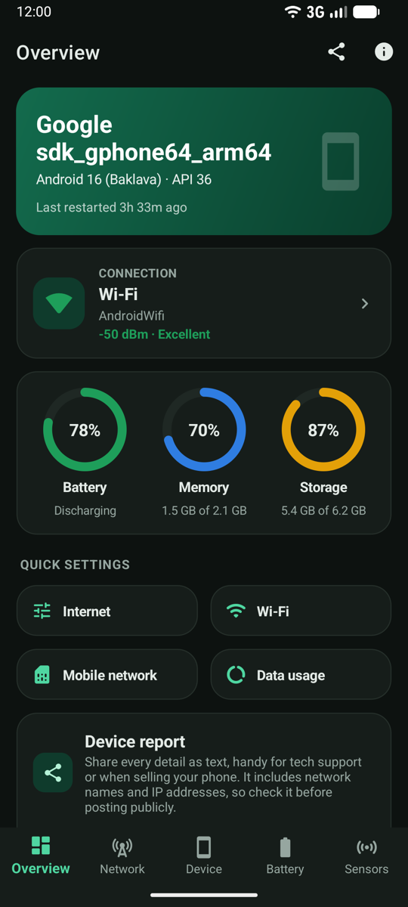

<p align="center">
  
</p>

<h1 align="center">Mobile Network Info</h1>

<p align="center">
  Everything about your Android phone's network, hardware, battery and sensors, in one clean app.<br>
  <b>Free · No ads · No tracking · Source available</b>
</p>

<p align="center">
  <a href="https://play.google.com/store/apps/details?id=lk.stechbuzz.networktoggler"></a>
</p>

<p align="center">
  
  
  
  <a href="LICENSE"></a>
  <a href="https://buymeacoffee.com/jkhy9gtjs"></a>
</p>

---

## Screenshots

| Overview | Network | Wi-Fi scanner | Device |
|:---:|:---:|:---:|:---:|
|  |  |  |  |

| Battery | Sensors | What's new | Dark mode |
|:---:|:---:|:---:|:---:|
|  |  |  |  |

## Features

### 📶 Network
- **Connection status**: Wi-Fi, mobile data, Ethernet or VPN, verified internet access, metered and roaming state, Data Saver, Private DNS and Android's bandwidth estimate.
- **Wi-Fi details**: network name, BSSID, signal strength with a quality rating, frequency, band and channel, Wi-Fi standard (Wi-Fi 4/5/6/6E/7), link speeds, security type and supported bands.
- **Wi-Fi scanner**: nearby networks with signal, channel, band, width, standard and security; open networks are flagged.
- **Mobile network**: carrier, MCC/MNC, country, 2G/3G/4G/5G (including 5G NSA/SA), signal strength and LTE/5G RSRP, RSRQ and SINR, roaming and SIM information.
- **Serving cell**: cell ID, eNodeB/sector, TAC/LAC, PCI, EARFCN/ARFCN, band, bandwidth and neighbouring cells.
- **IP & DNS**: interface, IPv4/IPv6 addresses, gateway, DNS servers, MTU, proxy and your public IP (on request).
- **Connection test**: latency and jitter to Cloudflare and Google, with a plain-language rating.

### 📱 Device
- Model, manufacturer, brand, board and hardware.
- Android version, API level, security patch, build number and date, kernel, bootloader and baseband.
- Processor: chipset, cores, CPU clusters and maximum frequency, supported ABIs.
- Memory and storage usage.
- Display: resolution, density, size, refresh rates, HDR and wide colour support.
- Hardware features: NFC, eSIM, UWB, Wi-Fi Direct/Aware/RTT, fingerprint, IR blaster and more.

### 🔋 Battery
- Level, status, power source, health, temperature, voltage and technology.
- Charging/discharging current, remaining charge, estimated capacity, charge cycles and time until full.

### 🧭 Sensors
- Live compass with heading and direction.
- Device tilt (pitch, roll, yaw), accelerometer, gyroscope and magnetometer.
- Air pressure with estimated altitude, light level and proximity.
- A list of every sensor in the phone.

### 🛠 Everything else
- **Overview dashboard** with connection, battery, memory and storage at a glance.
- **Share a device report** as text, great for tech support or when selling a phone.
- **Tap any value to copy it.**
- **Quick shortcuts** to Android's Internet panel, Wi-Fi, mobile network and data usage settings.
- **Light and dark themes** that follow your system setting.
- **What's new** page written in plain language.

## Privacy

Mobile Network Info has **no ads, no analytics, no accounts and no tracking**. Everything it shows is read from your
phone and stays on your phone. Read the full [privacy policy](PRIVACY_POLICY.md).

| Permission | Why it's needed |
|---|---|
| Network state, Wi-Fi state | Show connection and Wi-Fi details. |
| Change Wi-Fi state | Start a Wi-Fi scan when you open the Wi-Fi scanner. |
| Internet | Connection test and public IP lookup, only when you tap them. |
| Location (precise, while using the app) | Android requires it to read the Wi-Fi name, nearby networks and cell tower details. Requested only when you ask for those details, never used in the background. |

## Support the project ☕

The app is free and ad-free. If you find it useful, you can support development:

<a href="https://buymeacoffee.com/jkhy9gtjs"></a>

Other ways to help: ⭐ star this repository, [rate the app on Google Play](https://play.google.com/store/apps/details?id=lk.stechbuzz.networktoggler),
[report a bug or suggest a feature](https://github.com/supunsarachitha/MobileNetworkInfo_V2/issues), or send a pull request.

## Building from source

**Requirements**

- [.NET 10 SDK](https://dotnet.microsoft.com/download) with the MAUI workload: `dotnet workload install maui`
- Android SDK with API 36 (installed with Android Studio or Visual Studio)
- JDK 17 or 21

**Run on a device or emulator**

```bash
dotnet build MobileNetworkInfo/MobileNetworkInfo.csproj -t:Run -f net10.0-android
```

**Run the unit tests**

```bash
dotnet test MobileNetworkInfo.Tests
```

**Create a release build** (`.aab` for Google Play and `.apk` for direct install)

```bash
dotnet publish MobileNetworkInfo/MobileNetworkInfo.csproj -f net10.0-android -c Release
# Output: MobileNetworkInfo/bin/Release/net10.0-android/publish/
```

Release signing is configured in `MobileNetworkInfo/signing.local.props`, which is git-ignored. Copy
[`signing.local.props.example`](MobileNetworkInfo/signing.local.props.example), fill in your keystore details,
and never commit passwords. Without it, release builds are signed with the debug key.

## Project structure

```
MobileNetworkInfo/            .NET MAUI app (Android)
├── Views/                    XAML pages (Overview, Network, Device, Battery, Sensors, …)
├── ViewModels/               MVVM view models (CommunityToolkit.Mvvm)
├── Services/                 Android APIs: network, device, battery, sensors, report
├── Helpers/                  Platform-independent logic (formatting, Wi-Fi channels, signal quality, …)
├── Controls/                 InfoCard, CompassView, RingGauge
├── Resources/                Colors, styles, icon font, app icon and splash
└── Platforms/Android/        Manifest, MainActivity, system bar handling
MobileNetworkInfo.Tests/      xUnit tests for Helpers
CHANGELOG.md                  User-facing release notes (also shown in the app)
PRIVACY_POLICY.md             Privacy policy linked from the app and Google Play
```

## Contributing

Contributions are welcome! Please open an issue to discuss bigger changes first. The [license](LICENSE) allows you to
modify the code to prepare pull requests for this repository; by submitting one, you agree that your contribution may be
distributed as part of the app. When you change the app:

1. Keep the build warning-free and run `dotnet test MobileNetworkInfo.Tests`.
2. Check the UI in both light and dark mode.
3. Add a short, plain-language entry to [CHANGELOG.md](CHANGELOG.md) under `New`, `Improved`, `Fixed` or `Removed`.
   It is shown to users on the in-app "What's new" page.

## License

Copyright © 2022–2026 Supun Sarachitha Liyanaarachchi.

The source code is available under the [PolyForm Strict License 1.0.0](LICENSE) with an additional permission for
contributions. You may read the code and use it for personal and other noncommercial purposes. **Commercial use and
distribution, including publishing the app or a modified version on any app store, are not permitted** without written
permission. To ask for permission, [open an issue](https://github.com/supunsarachitha/MobileNetworkInfo_V2/issues).

Icons are from [Material Icons](https://fonts.google.com/icons) by Google (Apache License 2.0).
